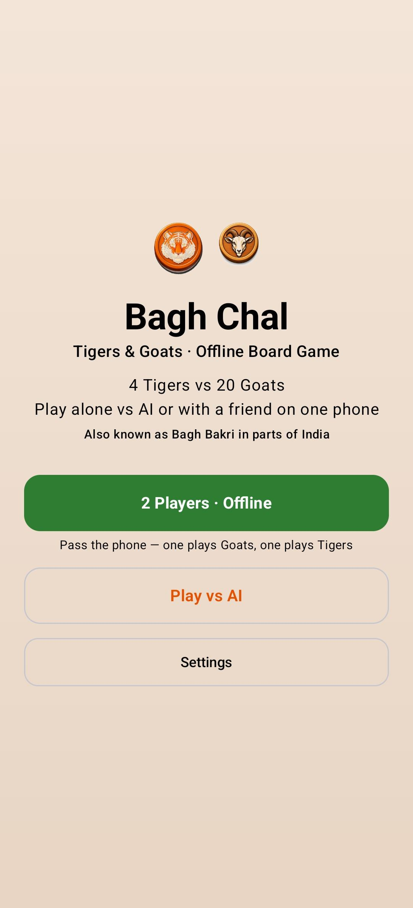
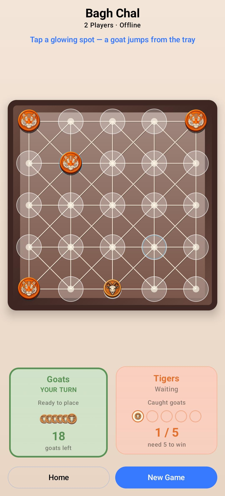
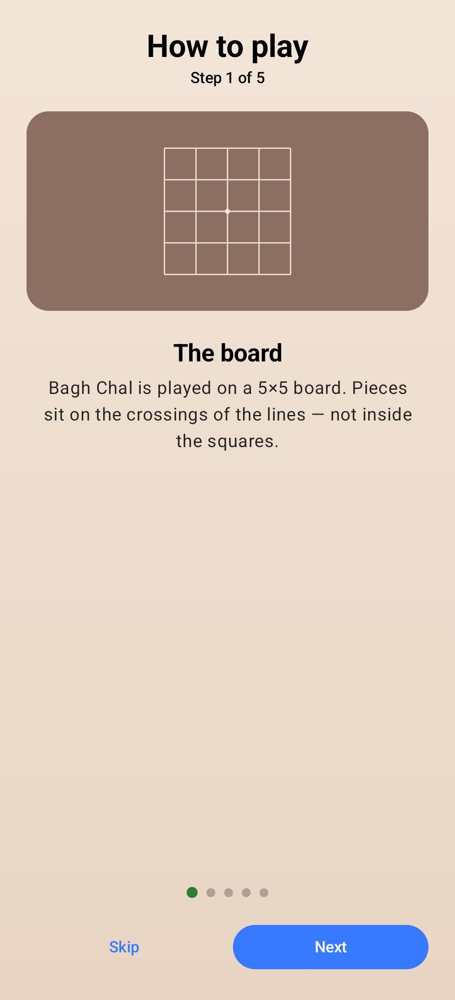
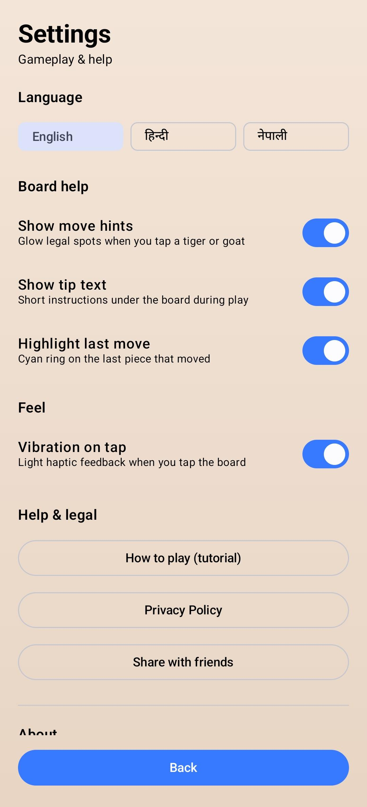

# Bagh Chal — Tigers & Goats

Android board game for the classic **Bagh Chal** (also known as **Bagh Bakri**) — four tigers vs twenty goats on a 5×5 board. Fully offline. Built with Kotlin and Jetpack Compose.

**Package:** `com.sohrab.baghbakri` · **Version:** 1.0

---

## Screenshots

<p align="center">
  
  
  
  
</p>

| Home | Gameplay | Tutorial | Settings |
|------|----------|----------|----------|
| Modes & branding | Live board with trays | Step-by-step rules | Language, hints, help |

---

## Features

- **2 Players · Offline** — pass-and-play on one device
- **Play vs AI** — Easy / Medium / Hard
- **Interactive tutorial** — learn the board and rules in a few steps
- **Languages** — English, Hindi, Nepali
- **Gameplay aids** — move hints, tip text, last-move highlight, vibration on tap
- **Works offline** — no account, no internet required for core play
- In-app **Privacy Policy**, share, and about

---

## How to play (short)

- Pieces sit on **line crossings**, not inside squares
- **Goats** place 20 pieces, then move to trap the tigers
- **Tigers** capture by jumping over a goat to an empty point
- **Tigers win** by catching 5 goats
- **Goats win** by blocking every tiger move

---

## Build

```bash
./gradlew assembleDebug
# Release AAB (needs keystore.properties / CI secrets):
./gradlew bundleRelease
```

- **minSdk** 29 · **targetSdk** 36
- CI: `.github/workflows/android-build.yml` (signed APK + AAB on `main`)

---

## Play Store assets

Ready graphics live in [`playstore-assets/`](playstore-assets/):

- App icon `icon-512.png`
- Feature graphic `feature-graphic-1024x500.png`
- Piece source art under `playstore-assets/pieces/`

Release checklist: [`docs/PLAYSTORE_RELEASE.md`](docs/PLAYSTORE_RELEASE.md)  
Privacy policy: [`docs/PRIVACY_POLICY.md`](docs/PRIVACY_POLICY.md)

---

## License / contact

See the Google Play listing for Bagh Chal — Tigers & Goats, or open an issue on this repository.
